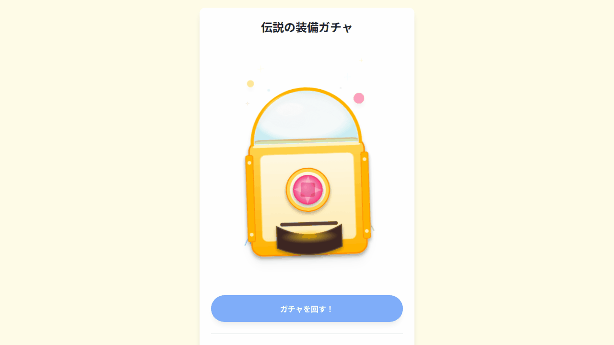

# 🤖 AI-Generated Gacha App (GAS + Google Drive)


This project was developed through a complete AI co-creation process where **"humans write specifications in natural language, and AI (Google Jules/Gemini) implements the code."**



## 🚀 Concept: Spec-Driven AI Development
The **Source of Truth** for this repository is not the code, but the **specification document (`doc/spec.ja.md`)**.
When adding features or making corrections, do not modify the code directly. Instead, we recommend the following flow:

1.  **Write the Spec**: Update `doc/spec.ja.md` (written in Gherkin-like natural language).
2.  **Ask the AI**: Instruct Google Jules or ChatGPT to "read this specification and update the implementation accordingly."
3.  **Maintain Quality**: `Biome` automatically checks code quality on GitHub Actions.

## Features (v3.1)
*   **New Machine Design**: Rich cabinet design using SVG and enhanced effects like flashing LEDs!
*   **Chain Promotion Animation**: Exciting effects where the capsule changes color one after another (e.g., Blue -> Red -> Gold)!
*   **Easy Configuration**: Manage grades and probabilities in `gacha.yaml` and item lists in `items.yaml`.
*   **Markdown Support**: Prize descriptions can be written in Markdown format, allowing for rich text display.
*   **Hybrid Architecture**: Supports both local execution via Docker containers and serverless GAS operation.
*   **Enhanced Security (v3.0.1)**: Robustness ensured based on OWASP guidelines, including path traversal and XSS protection.

## How to Play (Docker / Local Execution)

You can spin the gacha on your PC immediately using Docker.

### 1. Preparation
Clone this repository.

```bash
git clone <repository-url>
cd <repository-name>
```

### 2. Data Setup
Configure the gacha contents in the `gacha_data/gacha1/` folder.

*   **`gacha.yaml`**: Define grades (colors, promotion rates).
*   **`items.yaml`**: List prizes and their corresponding grades.
*   Place image files (`.png`/`.jpg`) and description files (`.md`) in the same folder.

**Example `gacha.yaml`:**
```yaml
name: "Legendary Equipment Gacha"
grades:
  G1:
    color: "blue"
    promotion:
      next_grade: "G2"
      rate: 0.1
```

**Example `items.yaml`:**
```yaml
- id: 1
  name: "Potion"
  grade: "G1"
  image: "potion.jpg"
  description: "potion.md"
  weight: 100
```

### 3. Launch
Start using Docker Compose.

```bash
cd docker
docker-compose up
```

Access `http://localhost:8000` in your browser.

## How to Play (Google Apps Script)

Instructions for using files on Google Drive as the data source.

1.  **Prepare Google Drive**:
    *   Create a folder named `MyGachaApp` in the root directory.
    *   Create a `gacha1` folder inside it and upload `gacha.yaml`, `items.yaml`, images, etc.
2.  **Deploy**:
    *   Push `gacha.js` and `gacha.html` to your GAS project using `clasp` or similar tools.
3.  **Run**:
    *   Deploy as a Web App and access the published URL.

## Developer Information

### Directory Structure
```
.
├── gacha.html        # Frontend (Vanilla JS + Tailwind + js-yaml)
├── gacha-logic.js    # Core Logic (Probability calculation, Promotion checks) - Target for Unit Tests
├── gacha_data/       # Data folder for local execution
│   └── gacha1/       # Gacha Set 1
├── docker/           # Docker related files
│   ├── Dockerfile
│   └── server.js     # Simple server for local execution
├── gacha.js          # Backend code for GAS
├── tests/            # Test code (Unit: Jest / E2E: Playwright)
└── doc/              # Documentation and Specifications
```

### Running Tests
```bash
# Install dependencies
npm install

# Unit Tests (Jest)
npm test

# E2E Tests (Playwright)
# Requires 'docker-compose up' in docker/ beforehand
npm run test:e2e
```

## 🛠 Tech Stack
*   **Runtime**: Google Apps Script (GAS)
*   **Database/Storage**: Google Drive (YAML & Images)
*   **Frontend**: HTML5, Tailwind CSS, Howler.js (Audio)
*   **Dev Tools**: Clasp, Biome, GitHub Actions

### Technology Stack
*   **Frontend**: HTML5, Tailwind CSS, SVG Animation, js-yaml
*   **Backend (Local)**: Node.js, Express
*   **Backend (Cloud)**: Google Apps Script

## Disclaimer
> Note on AI Generated Content:
> This project contains assets (images, sounds, code) generated by Artificial Intelligence models. While we strive for quality and safety, the generated content may contain artifacts or unexpected behaviors.
>
> 本プロジェクトに含まれる画像、音声、コードの一部はAIによって生成されています。意図しない出力が含まれる可能性があることをご了承ください。
