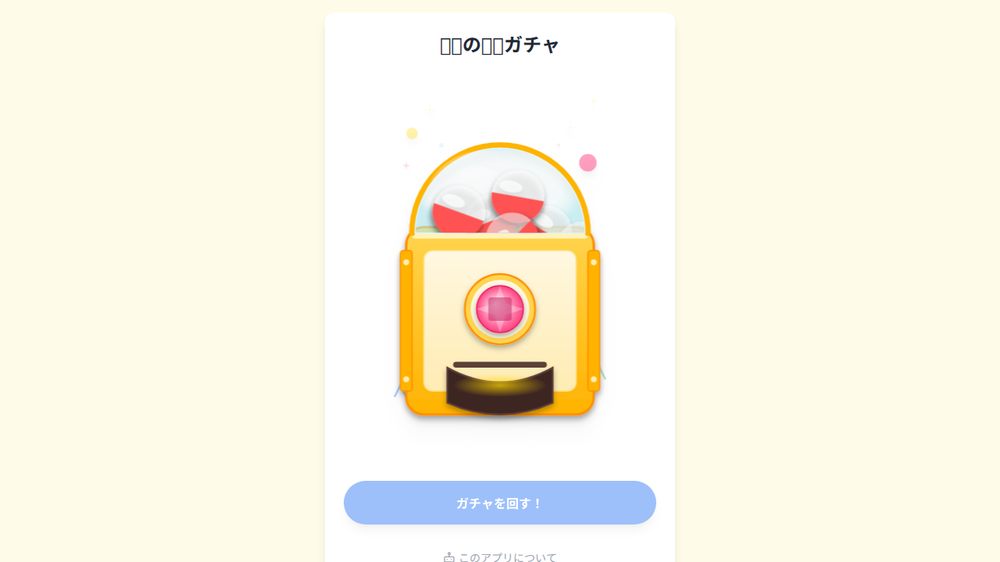

# 🤖 AI-Generated Gacha App (GAS + Google Drive)


このプロジェクトは、**「人間が自然言語で仕様を書き、AI (Google Jules/Gemini) がコードを実装する」** という完全な AI共創プロセスで開発されました。



## 🚀 開発コンセプト: Spec-Driven AI Development
このリポジトリの正本（Source of Truth）はコードではなく **仕様書 (`doc/spec.ja.md`)** です。
機能追加や修正を行う際は、直接コードを触るのではなく、以下のフローを推奨します。

1. **仕様を書く**: `doc/spec.ja.md` を更新する (Gherkinライクな自然言語で記述)。
2. **AIに依頼する**: Google Jules や ChatGPT に仕様書を読ませ、「この仕様に合わせて実装を修正して」と指示する。
3. **品質を保つ**: GitHub Actions 上で `Biome` がコード品質を自動チェックする。

## 特徴 (v3.1)
*   **新デザインマシーン**: SVGによるリッチな筐体デザインと、LED点滅などの強化された演出効果！
*   **連鎖昇格アニメーション**: 青→赤→金...とカプセルが次々と変化するドキドキの演出！
*   **設定が簡単**: `gacha.yaml` でグレードや確率を、`items.yaml` でアイテムリストを管理。
*   **Markdown対応**: 景品の説明文はMarkdown形式で記述でき、リッチなテキスト表示が可能。
*   **ハイブリッド構成**: Dockerコンテナでのローカル実行と、サーバーレスなGAS運用の両方に対応。
*   **セキュリティ強化 (v3.0.1)**: パストラバーサル対策、XSS対策などOWASPガイドラインに基づいた堅牢性を確保。

## 遊び方 (Docker / ローカル実行)

Dockerを使って、すぐに自分のPCでガチャを回すことができます。

### 1. 準備
このリポジトリをクローンします。

```bash
git clone <repository-url>
cd <repository-name>
```

### 2. データの設定
`gacha_data/gacha1/` フォルダにガチャの中身を設定します。

*   **`gacha.yaml`**: グレード定義（色、昇格確率）を記述します。
*   **`items.yaml`**: 景品のリストと所属グレードを記述します。
*   画像ファイル (`.png`/`.jpg`) と 説明ファイル (`.md`) を同じフォルダに置きます。

**gacha.yaml の例:**
```yaml
name: "伝説の装備ガチャ"
grades:
  G1:
    color: "blue"
    promotion:
      next_grade: "G2"
      rate: 0.1
```

**items.yaml の例:**
```yaml
- id: 1
  name: "回復薬"
  grade: "G1"
  image: "potion.jpg"
  description: "potion.md"
  weight: 100
```

### 3. 起動
Docker Compose を使用して起動します。

```bash
cd docker
docker-compose up
```

ブラウザで `http://localhost:8000` にアクセスしてください。

## 遊び方 (Google Apps Script)

Google Drive上のファイルをデータソースとして利用する場合の手順です。

1.  **Google Driveの準備**:
    *   ルートに `MyGachaApp` というフォルダを作成します。
    *   その中に `gacha1` フォルダを作成し、`gacha.yaml`, `items.yaml` や画像などをアップロードします。
2.  **デプロイ**:
    *   `clasp` などを使って `gacha.js` と `gacha.html` を GAS プロジェクトにプッシュします。
3.  **実行**:
    *   Webアプリとしてデプロイし、発行されたURLにアクセスします。

## 開発者向け情報

### ディレクトリ構成
```
.
├── gacha.html        # フロントエンド (Vanilla JS + Tailwind + js-yaml)
├── gacha-logic.js    # コアロジック（確率計算・昇格判定） - Unitテスト対象
├── gacha_data/       # ローカル実行用のデータフォルダ
│   └── gacha1/       # ガチャセット1
├── docker/           # Docker関連ファイル
│   ├── Dockerfile
│   └── server.js     # ローカル実行用簡易サーバー
├── gacha.js          # GAS用バックエンドコード
├── tests/            # テストコード (Unit: Jest / E2E: Playwright)
└── doc/              # ドキュメント・仕様書
```

### テスト実行方法
```bash
# 依存関係のインストール
npm install

# Unitテスト (Jest)
npm test

# E2Eテスト (Playwright)
# 事前に docker/ で docker-compose up が必要です
npm run test:e2e
```

## 🛠 Tech Stack
* **Runtime**: Google Apps Script (GAS)
* **Database/Storage**: Google Drive (YAML & Images)
* **Frontend**: HTML5, Tailwind CSS, Howler.js (Audio)
* **Dev Tools**: Clasp, Biome, GitHub Actions

### 技術スタック
*   **Frontend**: HTML5, Tailwind CSS, SVG Animation, js-yaml
*   **Backend (Local)**: Node.js, Express
*   **Backend (Cloud)**: Google Apps Script

## 免責事項 (Disclaimer)
> Note on AI Generated Content:
> This project contains assets (images, sounds, code) generated by Artificial Intelligence models. While we strive for quality and safety, the generated content may contain artifacts or unexpected behaviors.
>
> 本プロジェクトに含まれる画像、音声、コードの一部はAIによって生成されています。意図しない出力が含まれる可能性があることをご了承ください。
